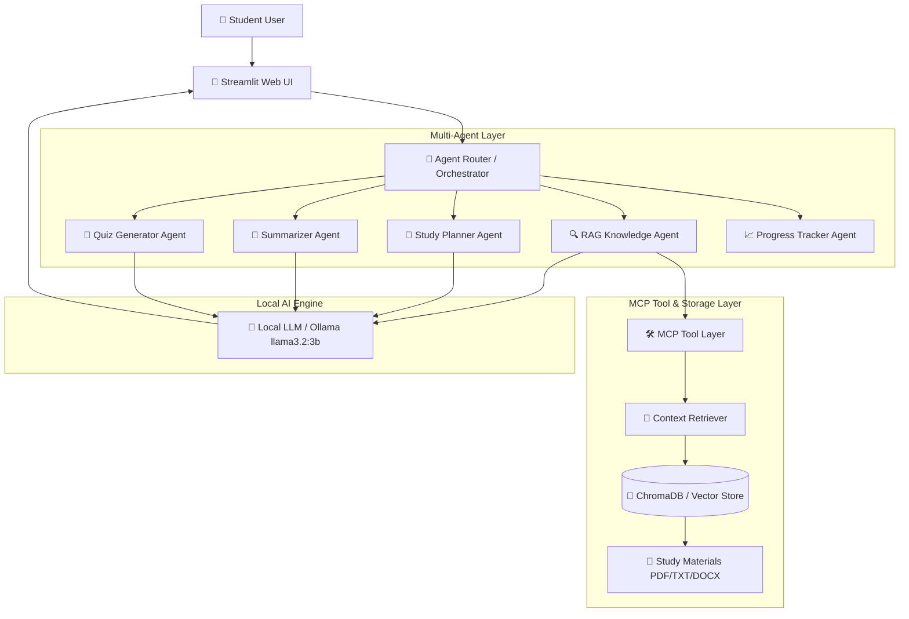
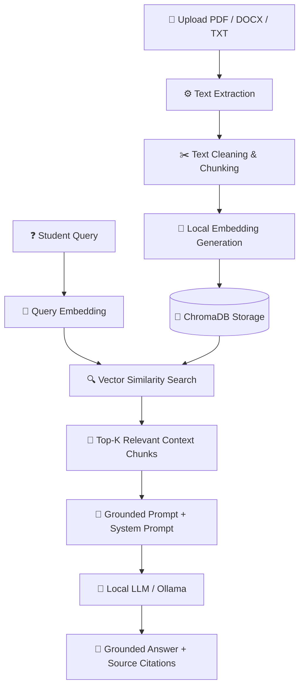
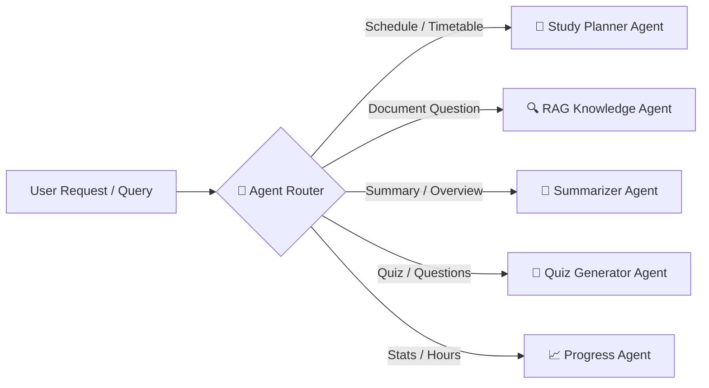
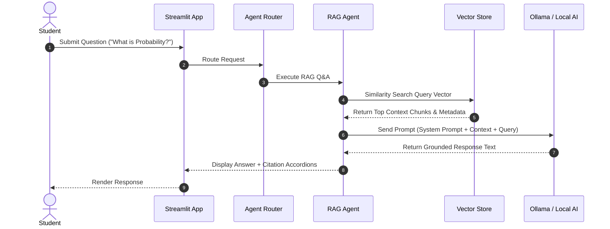

# 🎓 Study Assistant Agent (L2 AI Project)

An intelligent, privacy-preserving, AI-powered **Study Assistant Agent** designed to help students learn effectively from their own uploaded study materials.

Built with **Python**, **Streamlit**, **Local Sentence-Transformer Embeddings / Vector Store**, **ChromaDB**, and **Ollama** (with intelligent offline grounded synthesis fallback).

---

## 📌 Problem Statement

Students often struggle with managing large volumes of study material, identifying relevant information quickly, comprehending complex concepts, and organizing structured study schedules for upcoming exams. 

Standard commercial AI models frequently hallucinate facts or require paid API keys and external data upload. 

---

## 🎯 Objective

To develop a **local, grounded, multi-agent learning platform** that allows students to:
- Define study goals, exam timelines, and daily study capacity.
- Upload study notes in **PDF, DOCX, or TXT** formats.
- Ask questions grounded strictly in their uploaded study materials.
- Receive answers accompanied by **transparent source snippet citations**.
- Generate personalized, structured **day-by-day study schedules**.
- Produce **executive summaries, key concepts, and revision notes**.
- Create **grounded practice quizzes** (MCQs, short answer, conceptual).
- Track learning progress, logged study hours, and topic mastery.

---

## ⚡ Main Features

1. **🎓 Student Profile**: Goal tracking, exam date countdown, subject/topic configuration, daily capacity.
2. **📚 Multi-Format Upload**: Text extraction from PDF (`pypdf`), DOCX (`python-docx`), and TXT.
3. **🔍 Grounded RAG Q&A**: Question answering using vector similarity retrieval and strict source citations.
4. **📅 Personalized Study Planner**: Automated daily schedule generator distributing topics across available days.
5. **📝 Summarizer Agent**: Multi-level summary generation (Executive Summary, Key Concepts, High-Yield Points, Revision Notes).
6. **🧩 Practice Quiz Generator**: Material-grounded MCQs, short answer, and conceptual question generation.
7. **📈 Progress Activity Dashboard**: Completed vs pending topics tracking, study session logging, completion % stats.
8. **⚙️ RAG Evaluation Suite**: Quantitative calculation of **Faithfulness / Groundedness**, **Answer Relevancy**, and **Retrieval Relevance** metrics.
9. **🛠️ Model Context Protocol (MCP) Tool Layer**: Modular tool interface enabling agent routing and task dispatch.

---

## 🛠️ Technologies Used

| Layer | Technology |
| :--- | :--- |
| **User Interface** | Streamlit (Python Web App) |
| **Language & Logic** | Python 3.10+ |
| **Local LLM** | Ollama (`llama3.2:3b` / `mistral`) + Offline Grounded Fallback Synthesizer |
| **Embeddings** | `sentence-transformers` (`all-MiniLM-L6-v2`) / Dense Vectorizer |
| **Vector Database** | `ChromaDB` (Persistent local storage in `./vectorstore`) |
| **Document Loaders** | `pypdf`, `python-docx` |
| **Tool Protocol** | MCP (Model Context Protocol) Tool Layer |
| **Testing Suite** | `pytest` |

---

## 🏗️ Architecture & Diagrams

### 1. System Architecture



---

### 2. RAG Pipeline Workflow



---

### 3. Agent Router Workflow



---

### 4. Data Flow Diagram



---

## 🛠️ MCP (Model Context Protocol) Role Clarification

> [!IMPORTANT]
> **MCP is NOT the Vector Database.**
> In this architecture, **ChromaDB** serves as the persistent vector database engine. 
> **MCP (Model Context Protocol)** functions as the **standardized Tool Integration Layer** (`src/mcp_tools.py`) that exposes document retrieval, schedule planning, quiz generation, and progress tracking capabilities to the agent router.

```text
Study Documents ──> Text Processing ──> Vector Database (ChromaDB)
                                              │
                                              ▼
                                     Context Retriever
                                              │
                                              ▼
                                      MCP Tool Layer
                                              │
                                              ▼
                                    Study Assistant Agent
                                              │
                                              ▼
                                         Local LLM
```

---

## 📁 Project Structure

```text
SMART STUDY AGENT L2 PROJECT/
│
├── app.py                     # Main Streamlit Web Application
├── requirements.txt           # Project Python Dependencies
├── README.md                  # Comprehensive Documentation
├── .gitignore                 # Git Exclusion Config
│
├── data/
│   └── uploads/               # Uploaded PDF, TXT, DOCX files directory
│
├── vectorstore/               # ChromaDB Persistent Storage Directory
│
├── src/
│   ├── __init__.py            # Package Init
│   ├── system_prompt.py       # Central System Prompt & Prompt Templates
│   ├── document_loader.py     # PDF, DOCX, TXT Text Extractor
│   ├── text_splitter.py       # Clean Text Chunker with Metadata
│   ├── embeddings.py          # Local Embedding Manager
│   ├── vector_store.py        # ChromaDB & In-Memory Vector Store Manager
│   ├── retriever.py           # Similarity Search Context Retriever
│   ├── llm.py                 # Local LLM Handler (Ollama + Fallback)
│   ├── rag_agent.py           # RAG Grounded Question Answering Agent
│   ├── study_planner.py       # Study Schedule Generator Agent
│   ├── summarizer.py          # Academic Summarization Agent
│   ├── quiz_generator.py      # Practice Question Generator Agent
│   ├── progress_tracker.py    # Progress & Activity Tracker Agent
│   ├── mcp_tools.py           # MCP Tool Protocol Layer
│   ├── agent_router.py        # Agent Orchestrator & Router
│   └── evaluation.py          # RAG Evaluation Suite (Faithfulness, Relevancy)
│
└── tests/
    └── test_basic.py          # Automated Pytest Test Suite
```

---

## ⚙️ System Prompt Configuration

The system prompt is centrally defined in [`src/system_prompt.py`](file:///c:/Users/MuppidiNavyaSri/Desktop/SMART%20STUDY%20AGENT%20L2%20PROJECT/src/system_prompt.py).

Key Directives:
- **Strict Grounding**: Base all answers exclusively on retrieved document chunks.
- **No Hallucination**: Explicitly state *"Information not available in the uploaded study material"* when data is missing.
- **Educational Tone**: Use structured headers, bullet points, and practical examples.

---

## 🚀 Installation & Setup

### Prerequisites
- Python 3.10 or higher
- [Ollama](https://ollama.ai/) (Optional, for local LLM execution. Pull model: `ollama pull llama3.2:3b`)

### Step 1: Install Dependencies
```bash
pip install -r requirements.txt
```

### Step 2: Run Unit Tests
```bash
python -m pytest tests/test_basic.py
```

### Step 3: Launch Streamlit Web Application
```bash
streamlit run app.py
```

The application will automatically open in your default browser at `http://localhost:8501`.

---

## 💡 Example Usage & Test Queries

1. **Upload Notes**: Navigate to `Study Materials` and upload study notes (e.g., `algorithms_notes.pdf`).
2. **Generate Schedule**: Go to `Study Planner`, set your exam date and topics, click **Generate Personalized Study Plan**.
3. **Ask Questions**:
   - Query: *"What is the time complexity of quicksort?"*
   - Answer: Provided with exact source chunk citations.
4. **Ungrounded Question Handling**:
   - Query: *"What is the capital of France?"* (when not in uploaded notes)
   - Output: *"Information not found in study materials."*
5. **Practice Quiz**: Select topic in `Practice Quiz` tab and attempt generated MCQs.

---

## 📊 RAG System Evaluation

The platform features an automated RAG evaluator in [`src/evaluation.py`](file:///c:/Users/MuppidiNavyaSri/Desktop/SMART%20STUDY%20AGENT%20L2%20PROJECT/src/evaluation.py):

- **Faithfulness / Groundedness**: Measures what percentage of terms in the generated answer exist in retrieved document context.
- **Answer Relevancy**: Measures query keyword coverage in the generated answer.
- **Retrieval Relevance**: Measures vector similarity scores of top context chunks.

---

## ⚠️ Limitations & Future Enhancements

### Limitations
- OCR for handwritten image scans is not included in the basic document parser.
- Extremely large PDF files (>500 pages) take longer to process initially.

### Future Enhancements
- Flashcard deck auto-generation.
- Spaced-repetition study reminders.
- Audio note voice synthesis.
# Smart-study_agent

