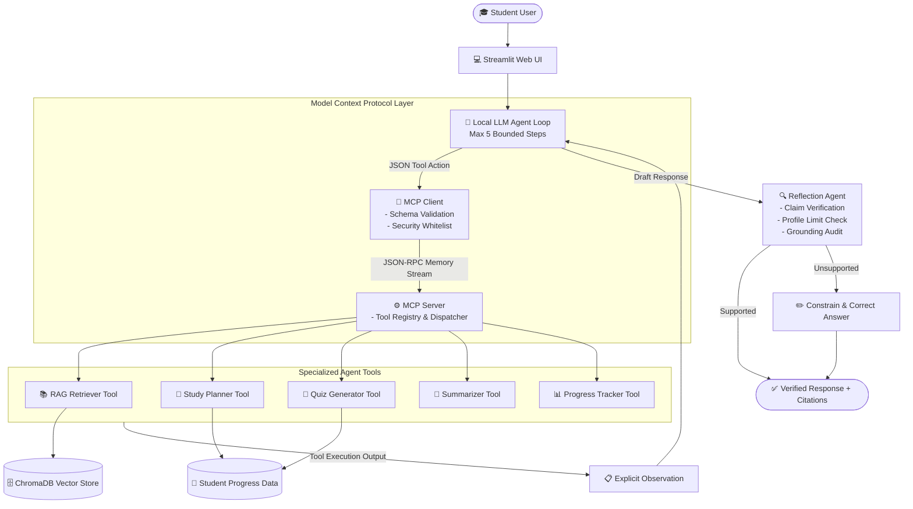
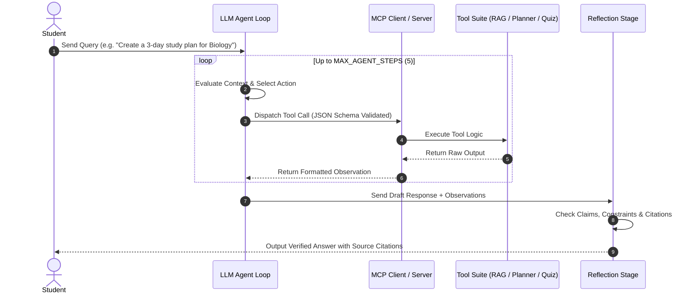

# 🎓 Study Assistant Agent — Agentic L2 AI System

[](https://www.python.org/)
[](https://streamlit.io/)
[](https://www.trychroma.com/)
[](https://modelcontextprotocol.io/)
[](https://docs.pytest.org/)

An autonomous, local, and privacy-preserving **AI Study Assistant Agent** built using local LLMs (Ollama / Llama 3.2), **Model Context Protocol (MCP)** client/server architecture, **ChromaDB** vector storage, bounded LLM reasoning loops, post-generation **Reflection**, and **Prompt-Injection** security defenses.

---

## 📌 Table of Contents

- [✨ Key Features](#-key-features)
- [🎯 Problem Statement & Solution](#-problem-statement--solution)
- [🏗️ System Architecture](#️-system-architecture)
- [⚡ Agent Execution Flow](#-agent-execution-flow)
- [⚠️ Important Distinction: MCP vs. Vector Database](#️-important-distinction-mcp-vs-vector-database)
- [🛠️ Key System Components](#️-key-system-components)
- [📂 Project File Structure](#-project-file-structure)
- [🚀 Quick Start & Installation](#-quick-start--installation)
- [🧪 Test Suite Overview](#-test-suite-overview)
- [🎓 Mentor Review Q&A Guide](#-mentor-review-qa-guide)

---

## ✨ Key Features

| Capability | Description |
| :--- | :--- |
| 🤖 **Autonomous Tool Loop** | Dynamic LLM tool loop capped at `MAX_AGENT_STEPS = 5`, replacing fragile keyword routing. |
| 🔌 **Model Context Protocol (MCP)** | Decoupled client-server architecture with tool discovery (`tools/list`) & JSON Schema validation. |
| 📚 **RAG & ChromaDB Store** | Fast local indexing of `PDF`, `TXT`, and `DOCX` files using SentenceTransformers and vector search. |
| 🔍 **Reflection Verification** | Post-generation auditing to prevent hallucinations, profile breaches, and ungrounded claims. |
| 🛡️ **Prompt Injection Security** | Sanitizes user inputs and wraps retrieved document text inside XML safety boundaries. |
| 📅 **Planner & Quiz Generator** | Exam countdown study schedules, multi-format quiz generation, and student progress metrics. |

---

## 🎯 Problem Statement & Solution

### The Challenge
Students face several challenges when preparing for exams:
* Managing large volumes of course materials across different file formats.
* Building realistic daily study plans aligned with exam deadlines and hour limits.
* Generating reliable practice quizzes and study summaries grounded strictly in authentic course content.
* Protecting private notes and academic documents from external cloud providers.

### The Solution
The **Study Assistant Agent** provides a private, 100% local, grounded learning system:
1. **Extracts & Indexes**: Parses and chunks PDFs, text files, and documents into a local **ChromaDB** vector database.
2. **Reasons Dynamically**: Employs an LLM tool-calling loop to pick the optimal tool based on student intent.
3. **Generates Grounded Assets**: Automatically creates schedules, summaries, practice quizzes, and tracks study progress.
4. **Validates & Reflects**: Runs a Reflection step to eliminate hallucinations, enforce daily hour limits, and audit citations.
5. **Secures Context**: Wraps untrusted document content in XML tags to block prompt injection attacks.

---

## 🏗️ System Architecture



---

## ⚡ Agent Execution Flow



---

## ⚠️ Important Distinction: MCP vs. Vector Database

> [!IMPORTANT]
> **MCP is NOT a Vector Database.**
> 
> * 🔌 **Model Context Protocol (MCP)**: A standardized client-server protocol layer that handles tool discovery (`tools/list`), input parameter validation (Pydantic), security whitelisting, and execution request dispatching (`tools/call`).
> * 🗄️ **ChromaDB**: A vector database layer that converts study text into high-dimensional vector embeddings, indexes them, and executes cosine similarity searches.
> 
> **How they work together:** MCP standardizes how the LLM agent discovers and invokes tools (such as the RAG retriever, Planner, and Quiz Generator), while ChromaDB handles vector storage and retrieval.

---

## 🛠️ Key System Components

1. **LLM-Driven Bounded Tool Loop (`src/agent_loop.py`)**  
   Replaces rigid keyword parsing with a dynamic LLM decision loop capped at `MAX_AGENT_STEPS = 5` to prevent execution loops.

2. **MCP Client & Server Architecture (`src/mcp/`)**  
   * `server.py`: Runs an `mcp.server.Server` instance exposing tools with JSON Schema definitions.
   * `client.py`: Discovers tools (`session.list_tools()`), checks argument types using Pydantic, validates against security whitelists, and executes requests.

3. **Pydantic Schema Validation (`src/tool_schemas.py`)**  
   Enforces strict typed constraints, default fallback values, and rejects unexpected arguments (`extra="forbid"`).

4. **Explicit Tool Observations (`src/observations.py`)**  
   Formats tool outputs into structured observation text blocks:
   ```text
   OBSERVATION
   Tool: rag_retriever
   Status: SUCCESS
   Result: Extracted 3 relevant document chunks...
   ```

5. **Reflection & Grounding Verification (`src/reflection.py`)**  
   Audits draft responses to detect hallucinations, profile constraint violations (e.g., daily study hour caps), and ungrounded claims, modifying output prior to presentation.

6. **Prompt Injection Defense (`src/prompt_injection.py`)**  
   Intercepts instruction overrides and wraps retrieved user document content inside XML delimiters (`<untrusted_content>...`) to block contextual hijacking.

---

## 📂 Project File Structure

```text
SMART STUDY AGENT L2 PROJECT/
├── app.py                      # Streamlit User Interface
├── requirements.txt            # Python dependencies
├── README.md                   # Project documentation
│
├── src/                        # Core Application Source Code
│   ├── agent_loop.py           # Bounded LLM decision & tool execution loop
│   ├── agent_router.py         # Intent parsing & tool dispatch routing
│   ├── document_loader.py      # PDF, TXT, DOCX text extraction
│   ├── embeddings.py           # SentenceTransformer vector embedding pipeline
│   ├── evaluation.py           # Groundedness & citation verification scoring
│   ├── llm.py                  # Ollama / Local LLM integration client
│   ├── mcp_tools.py            # Concrete tool functions (RAG, Planner, Quiz, etc.)
│   ├── observations.py         # Structured tool observation formatter
│   ├── progress_tracker.py     # Student study progress & metrics tracker
│   ├── prompt_injection.py     # Security sanitizer & XML boundary wrapper
│   ├── quiz_generator.py       # MCQ & Short-answer test generator
│   ├── rag_agent.py            # Retrieval-Augmented Generation handler
│   ├── reflection.py           # Post-generation reflection & sanity check
│   ├── retriever.py            # Semantic retrieval wrapper for ChromaDB
│   ├── study_planner.py        # Exam countdown & schedule builder
│   ├── summarizer.py           # Document summary generator
│   ├── system_prompt.py        # Core system prompts & agent instructions
│   ├── text_splitter.py        # Recursive text chunking utility
│   ├── tool_schemas.py         # Pydantic input/output schemas for tool validation
│   ├── vector_store.py         # ChromaDB manager (indexing & similarity search)
│   └── mcp/                    # Model Context Protocol Implementation
│       ├── client.py           # MCP Client & tool discovery
│       ├── schemas.py          # MCP JSON-RPC payload schemas
│       └── server.py           # MCP Server & tool dispatcher
│
└── tests/                      # Automated Pytest Test Suite
    ├── test_basic.py               # Baseline functionality tests
    ├── test_invalid_model_actions.py # Rejection of forbidden/malformed tools
    ├── test_mcp_client.py          # MCP client discovery & validation tests
    ├── test_mcp_integration.py     # End-to-end MCP client-server transport tests
    ├── test_mcp_server.py          # MCP server tool dispatching tests
    ├── test_missing_tool_data.py   # Graceful handling of missing/null tool data
    ├── test_partial_tool_data.py   # Profile limit enforcement on partial data
    ├── test_prompt_injection.py    # System prompt override security tests
    ├── test_rag_grounding.py       # RAG retrieval relevancy & citation tests
    ├── test_reflection.py          # Post-generation reflection auditing tests
    └── test_tool_selection.py      # LLM dynamic tool decision tests
```

---

## 🚀 Quick Start & Installation

### Prerequisites
* **Python**: `3.10` or higher installed.
* **Ollama (Optional)**: Installed locally with `llama3.2:3b` model pulled for local LLM execution.

### Step 1: Install Dependencies

```bash
pip install -r requirements.txt
```

### Step 2: Run Pytest Test Suite

Verify that all system components, MCP protocols, and safety reflection layers are functioning correctly:

```bash
python -m pytest
```

### Step 3: Launch the Streamlit Application

```bash
streamlit run app.py
```

Access the user interface in your web browser at `http://localhost:8501`.

---

## 🧪 Test Suite Overview

The project features 11 comprehensive test modules (26 pytest test cases):

| Test Suite | Focus Area |
| :--- | :--- |
| `test_basic.py` | Validates core baseline setup and tool instantiation. |
| `test_tool_selection.py` | Tests dynamic LLM decision-making when selecting tools. |
| `test_invalid_model_actions.py` | Verifies rejection of unauthorized actions (e.g. `delete_database`), bad types, missing parameters, and extra forbidden fields. |
| `test_missing_tool_data.py` | Ensures graceful handling when tools return null or missing responses without hallucinating. |
| `test_partial_tool_data.py` | Enforces student profile constraints when partial data is returned. |
| `test_mcp_client.py` | Tests tool discovery (`tools/list`) and Pydantic parameter validation in the MCP Client. |
| `test_mcp_server.py` | Tests execution request dispatching in the MCP Server. |
| `test_mcp_integration.py` | Tests end-to-end memory-stream communication between MCP Client and Server. |
| `test_reflection.py` | Tests factual claim auditing, daily study hour limit enforcement, and answer correction. |
| `test_rag_grounding.py` | Tests document parsing, chunking, embedding, vector search relevancy, and citation generation. |
| `test_prompt_injection.py` | Tests interception of system prompt overrides and XML boundary wrapping. |

---

## 🎓 Mentor Review Q&A Guide

Use these concise answers during code reviews or project presentations:

<details>
<summary><b>1. Why did you replace keyword routing?</b></summary>
<br>

> *Answer:* Keyword routing is rigid and brittle, failing whenever a student rephrases a prompt. Replacing it with an LLM-driven tool loop allows the agent to reason dynamically about user intent, inspect available tool schemas, and handle multi-step workflows autonomously.
</details>

<details>
<summary><b>2. What is the LLM-driven tool loop?</b></summary>
<br>

> *Answer:* An iterative reasoning loop where the LLM evaluates user input and prior tool outputs to decide whether to invoke an MCP tool or finalize the answer. The loop is strictly capped at `MAX_AGENT_STEPS = 5` to prevent infinite loops.
</details>

<details>
<summary><b>3. What is an observation?</b></summary>
<br>

> *Answer:* An explicit, structured text block formatted as `OBSERVATION\nTool: ...\nStatus: ...\nResult: ...` that communicates tool execution results back to the LLM agent without losing context.
</details>

<details>
<summary><b>4. What is MCP (Model Context Protocol)?</b></summary>
<br>

> *Answer:* MCP is an open standard that decouples AI models from tools and data sources. It provides standardized schema discovery, typed parameter enforcement, and safe execution dispatch.
</details>

<details>
<summary><b>5. How does the MCP Client communicate with the MCP Server?</b></summary>
<br>

> *Answer:* Over `anyio` memory-stream transport channels using standard JSON-RPC request and response payloads.
</details>

<details>
<summary><b>6. How does tool discovery work in MCP?</b></summary>
<br>

> *Answer:* The MCP Client sends a `tools/list` request to the MCP Server, which responds with a manifest containing tool names, descriptions, and JSON Schema input requirements.
</details>

<details>
<summary><b>7. How do you validate tool arguments?</b></summary>
<br>

> *Answer:* Using Pydantic data schemas configured with `extra="forbid"`. This validates input types, checks mandatory fields, and rejects unexpected arguments prior to execution.
</details>

<details>
<summary><b>8. What is the Reflection stage?</b></summary>
<br>

> *Answer:* A post-generation verification step where an agent audits draft responses against retrieved context, tool observations, and student profile rules before presenting the answer to the user.
</details>

<details>
<summary><b>9. How does Reflection prevent hallucinations?</b></summary>
<br>

> *Answer:* By checking if factual claims in the draft answer are supported by retrieved document chunks, automatically constraining or correcting any ungrounded assertions.
</details>

<details>
<summary><b>10. How does the RAG pipeline work?</b></summary>
<br>

> *Answer:* Text is extracted from uploaded files (PDF, TXT, DOCX), recursively split into chunks, embedded into vector representations using SentenceTransformers, stored in ChromaDB, and retrieved via cosine similarity.
</details>

<details>
<summary><b>11. Where is ChromaDB used in the codebase?</b></summary>
<br>

> *Answer:* In `src/vector_store.py`, where it manages document chunk storage, index persistence, and semantic vector retrieval.
</details>

<details>
<summary><b>12. How does the application handle errors gracefully?</b></summary>
<br>

> *Answer:* Via explicit Python try-except logging blocks that capture failures without swallowing critical runtime errors or exposing internal sensitive data to the UI.
</details>

<details>
<summary><b>13. What automated tests were implemented?</b></summary>
<br>

> *Answer:* 11 Pytest modules (26 tests total) covering tool selection, invalid actions, MCP client-server integration, reflection auditing, RAG grounding, prompt injection defenses, and missing data handling.
</details>

<details>
<summary><b>14. How do you defend against Prompt Injection?</b></summary>
<br>

> *Answer:* By scanning queries with regex filters to catch override attempts and isolating untrusted retrieved document text within `<untrusted_content>` XML tags accompanied by explicit agent instructions.
</details>

<details>
<summary><b>15. How do you verify citation accuracy?</b></summary>
<br>

> *Answer:* By comparing key content words in the generated claim with the source document chunk to generate a groundedness score, ensuring citations point to relevant source material.
</details>

---

## 📄 License & Acknowledgments

This project is built for educational and research purposes as an **Agentic Level 2 AI System**.

* **Model Context Protocol**: Built following standard MCP specifications.
* **ChromaDB**: Powered by [Chroma](https://www.trychroma.com/).
* **UI**: Built with [Streamlit](https://streamlit.io/).# Smart-study_agent

